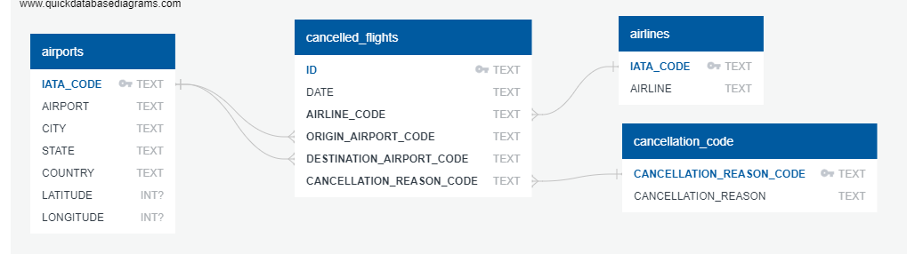

# ETL Project

**Team Members**: Sanjive Agarwal, Kasia Kalemba, Akshita Parasrampuria, Mitesh Parekh

**Scope**: Extract, Transform, and Load data from various sources to help facilitate analysis related to domestic flight cancellations in the US.

**Data Sources:**
*	U.S. Department of Transportation’s (DOT) Bureau of Transportation Statistics 
*	Kaggle (site for downloading datafiles)

**Data Files Extracted:**
*	Airlines (CSV file)
*	US Airports (CSV file)
*	Cancellation Codes Table (CSV File)
*	2015 Flight Schedule (CSV File)

**Data Transformation via Python/Jupyter Notebook:**
*	*Data Selection*: The initial data contains 5819079 observations and 45 variables (divided within the three datafiles), from that selected cancelled flights and relevant data points.
*	*Data Summarization*: creating a Date field from Day, Month, Year fields and storing as a Datetime field
*	*Data Joining*: 
    -	Using IATA_Code to join Airports and Cancelled_Flights to add in airport information
    -	Using Cancellation_Reason_Code to join Cancelled_Flights and Cancellation_code table to show Cancellation Reason with Cancelled Flight information  
*	*Data Cleaning*: removing unnecessary columns from data prior to loading
 
**Data Loading via Pandas:**
*	Schema visualized via quickdatabasediagrams.com

 
*	PGAdmin Platform
*	Tables
    -	Airports (IATA_Code = Primary Key)
    -	Cancelled Flights
    -	Airlines (IATA_Code = Primary Key)
    -	Cancellation Code (Cancellation_Reason_Code = Primary Key)

**Possible Data Analysis:**
*	Flight Cancellation Reasons
    -	Percentage breakdown of cancellation reasons
    -	Cancellations due to weather by month of the year
    -	Weather Cancellations vs. Latitude
    -	Trending of cancellation reasons by day of week
    -	Trending of cancellation reasons by month
*	Airline Cancellations
    -	Number of cancellations per airline
    -	Cancellation reasons broken down by airline
*	Airport Cancellations
    -	Number of cancellations by origin airport
    -	Number of cancellations by destination airport

**Sample Data Analysis**

Heatmap of Airports in the United States:

 

