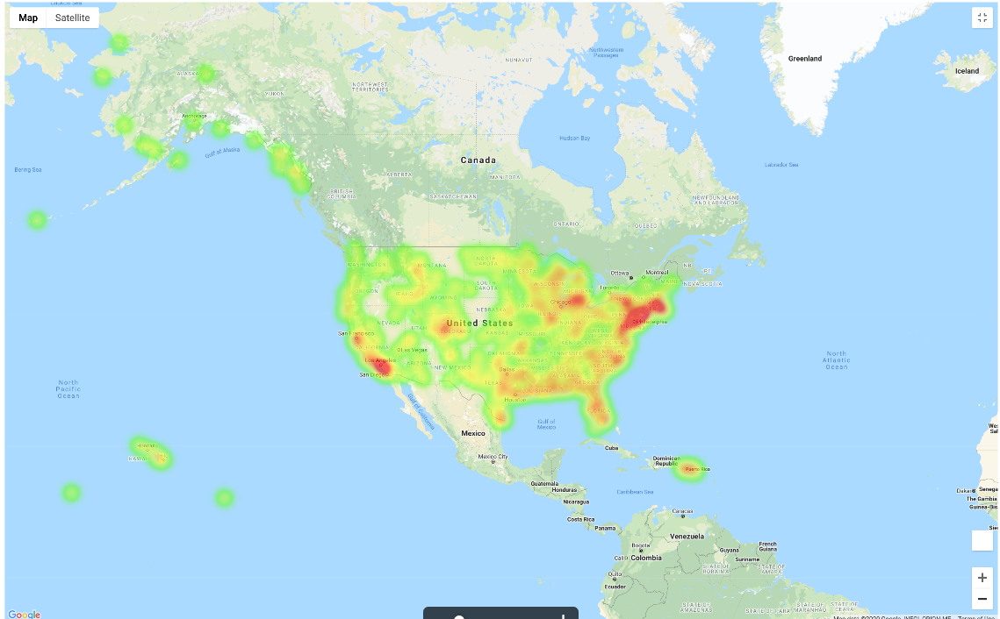

# ETL Project - US Domestic Flight Cancellations

**Team Members**: Sanjive Agarwal, Kasia Kalemba, Akshita Parasrampuria, Mitesh Parekh

**Scope**: Extract, Transform, and Load data from various sources to help facilitate analysis related to domestic flight cancellations in the US.

**Motivation:**
Based on the recent heavy flight cancellations and airport shutdowns, our group was interested into looking what cancellation patterns look like during a non-pandemic world state. We were curious to look at the airports and the airlines that had the most cancellations. We came across a data set which included airports, airlines, locations and cancellation reasons for 322 major US airports and major airline carriers.

**Data Sources:**
*	U.S. Department of Transportation’s (DOT) Bureau of Transportation Statistics
*	Kaggle (site for downloading .csv datafiles)

**Data Files Extracted:**
*	Airlines (CSV file)
*	US Airports (CSV file)
*	Cancellation Codes Table (CSV File)
*	2015 Flight Schedule (CSV File)

**Data Transformation via Python/Jupyter Notebook:**
*	*Data Selection*: The Flight Schedule contains 5,819,079 observations and 45 variables along with 3 reference data files.
*	*Data Summarization*:
    *   Extracted data records for Flight Cancellations only.
    *   joined the transaction data with the reference data to translate IATA Airlines, Airport and Cancellation codes to desciptive values.
    *   Create a DateTime field out of the Yeaer, month and Day columns
    *   Dropped transaction records with no valid Airport codes in the reference data
*	*Data Joining*:
    -	Used IATA Airlines and Airport codes to join with the Airliena dn Airport Information.Airports
    -	Used the DOT's Cancellation Code table to join with the transaction table to get the descriptive Cancellation code information.
*	*Data Cleaning*:
    *   Filtered out the transactions that had no Airport code mappings
    *   Filtered for NaN/Null data in the the key columns like Airport Code and Airlines codes.

**Data Modeling**
*   Data was modeled using QuickDatabaseDiagrams
*   A Database Schema SQL was generated for creation of the tables and Views in the Postgres database
*   Relevant PK and FK were defined
*   A view was also created to make data querying easier

    1. **Flight Cancellations ER Diagram**

    2. **Flight Cancellations Schema SQL**
(Link to schema SQL --> [Schema SQL](/doc/cancelled_flights-schema.sql))

**Database, Tables and Views Creation**
*   Postgres PGAdmin tool was used to create
    *   Database - flight_db
    *   Tables
        -   aiports
        -   airlines
        -   cancellation_code
        -   cancelled_flights

        Primary Key (PK) and Foreign Key (FK) defined for each table (Refer to the ER diagram for PK and FK details)
    *   View  - cancelled_flights_vw

**Data Loading via Pandas:**
*	Data loading to the postgres tables was performed via Pandas in Jupyter Notebook once the tables were created in Postgres DB.

**Steps to Load the Data**
* Get the raw data .csv files (downloaded from Kaggle and stored in Github project)
* Load the .csv files into Pandas dataframe via Jupyter notebook
* Perform data cleansing
    * filter out the flight cancellation related data
    * drop the records that do not have valid Airport or Airlines IATA code.
* Invoke PostgreSQL server
* Create database "flight_db"
* Execute the script [Schema SQL](/doc/cancelled_flights-schema.sql) to create tables and views
* Load the data into the tables using Pandas via running jupyter notebook
* Validate the data loaded into the tables by running Pandas SQL queries in jupyter notebook

**Possible Data Analysis:**
*	Flight Cancellation Reasons 
    -	Percentage breakdown of cancellation reasons
    -	Cancellations due to weather by month of the year
    -	Weather Cancellations vs. Latitude
    -	Trending of cancellation reasons by day of week
    -	Trending of cancellation reasons by month
*	Airline Cancellations
    -	Number of cancellations per airline
    -	Cancellation reasons broken down by airline
*	Airport Cancellations
    -	Number of cancellations by origin airport
    -	Number of cancellations by destination airport

**Sample Data Analysis**

Heatmap of the major Airports in the United States:

